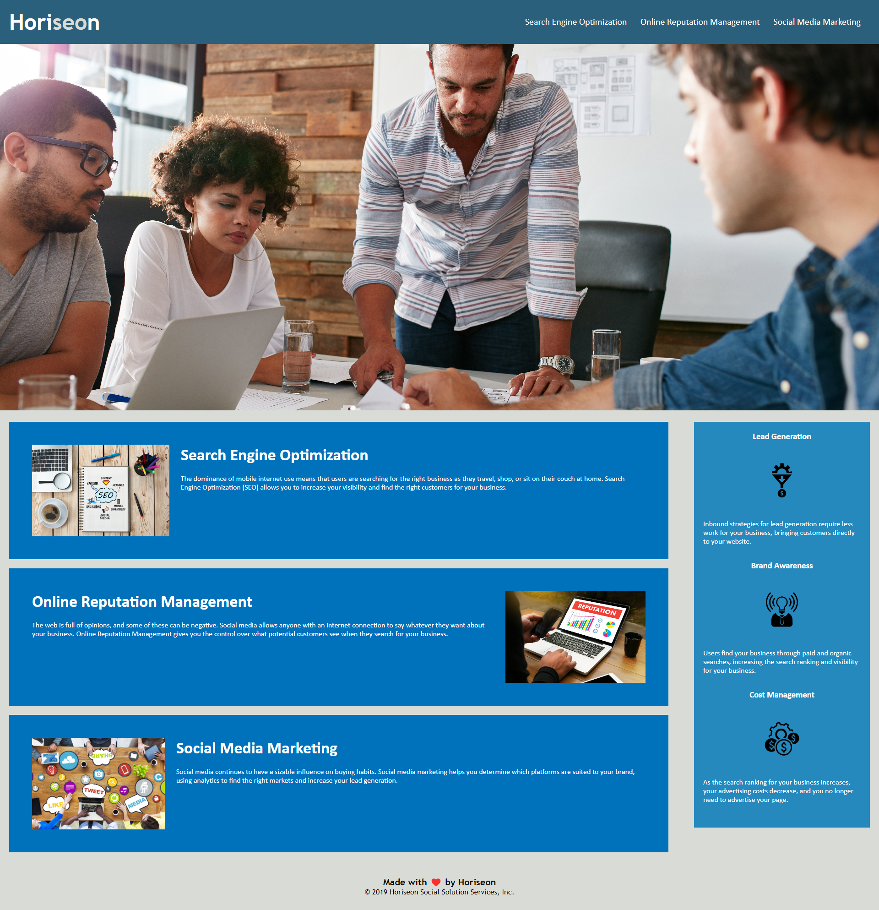

# :full_moon: About The Project

**Horiseon** is a Social Solution Services company with a website that contains serious problems with repetitive, non-semantic and disorganized code, preventing adequate accessibility, causing a negative impact on SEO and sales of its services.

The code was refactored, bringing all these negative points to the positive side, having an important impact for **Horiseon** in attracting new customers.

# :waxing_gibbous_moon: Features

- Strong **Accessibility**
- Strong **Semantics**

# :first_quarter_moon: Screenshot

# :waxing_crescent_moon: Philosophy

## Why Accessibility is Important?

**Accessibility** means that all people can perceive, understand, navigate, and interact with electronic information and be active, contributing members of the digital world.

Visual, auditory, physical, speech, cognitive, and neurological disabilities should be taken into account when implementing accessibility measures.

By: **National Center on Deaf-Blindness**

# :new_moon: Technologies

- HTML
- CSS

# :copyright: Credits

[National Center on Deaf-Blindness](https://zlnk.io/GsWhr8)

# :earth_americas: Website

- [Horiseon](https://whybruno.github.io/code-refactor)

# :globe_with_meridians: License

MIT License